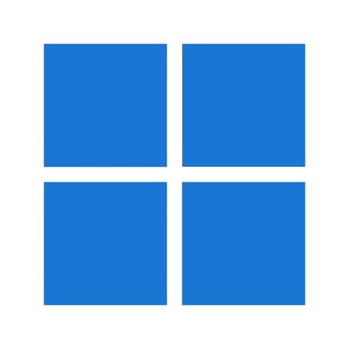
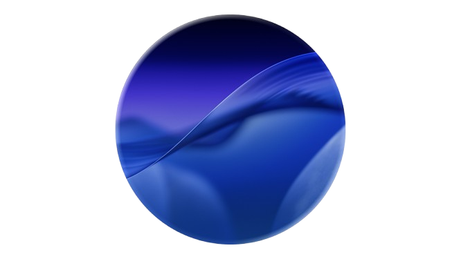
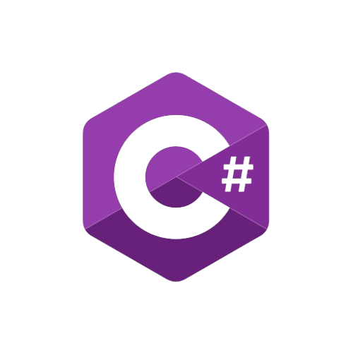
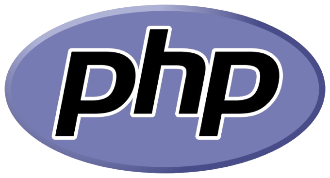
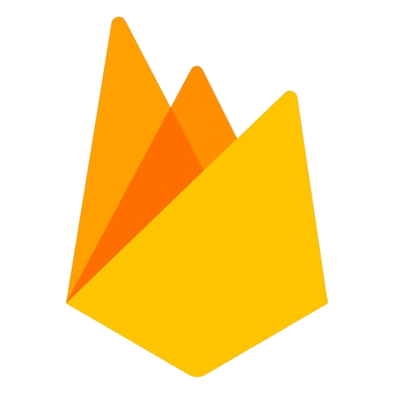
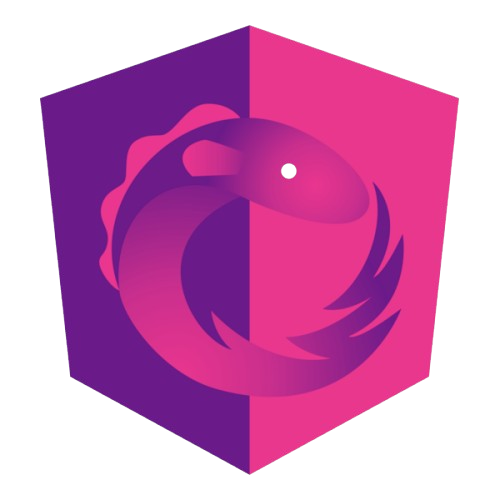

# Greetings 👋! I'm Davit Yedigaryan

 Greetings and welcome to my profile! I'm an expert Full Stack developer focused on Frontend backed by over four years of hands-on experience in both startup and enterprise environments. I'm not just a programmer; I'm a devoted craftsman passionate about bringing innovative ideas to life through code.

#### **Technical Expertise:**
My proficiency extends across React, NextJS, JavaScript, Angular 2+, C# and .NET, RXJS, and NgRX. While Angular is my specialty, I bring a comprehensive understanding of other front-end technologies, including React and Vue.js.

**Problem-Solving and Creativity:**
I thrive on tackling complex challenges that demand out-of-the-box thinking. As the go-to person for creative problem-solving, I bring a unique skill set that sets me apart in any tech team.

#### **Risk Worth Taking:**
Hiring a new team member is always a calculated risk. With me, it's a calculated one. I am committed to excellence, ensuring that solutions and results not only meet expectations but exceed them.

#### **Tech Excellence, Done Right:**
In the ever-evolving tech landscape, it's not just about getting the job done; it's about getting it done right. I am dedicated to delivering solutions that everyone involved can take pride in.

- 👀 I’m passionate about **JavaScript** but more Like strong typed languages like **Typescript**, specializing in **Angular** and **React**. I thrive on tackling complex challenges that demand creative problem-solving.
- 🌱 Currently, I'm immersed in projects involving Electron, Angular, React, Ionic and NX, and I'm always eager to explore innovative technologies.
- 💞️ I’m enthusiastic about collaborating on projects that contribute positively to humanity.

### Connect with me:

 

### Operating Systems: 

### Languages: 

### Tools & Platforms:

### Frameworks & Libraries:

  
