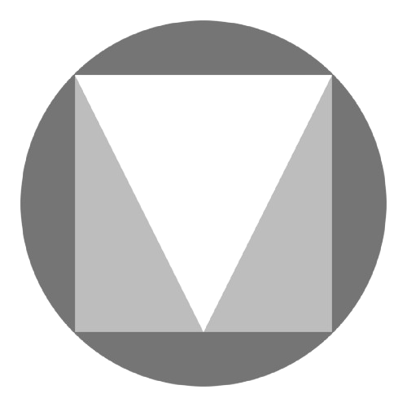
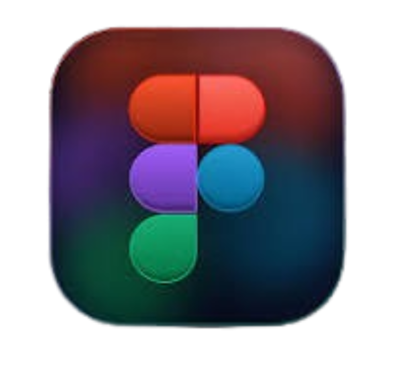
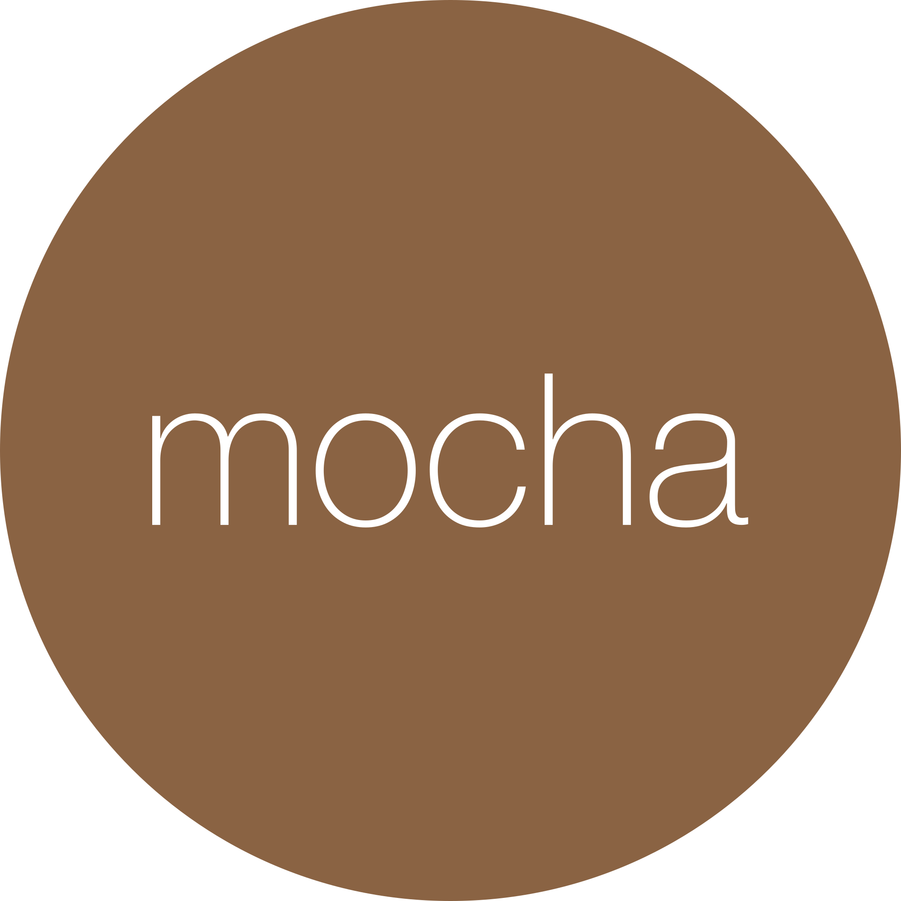

# Greetings 👋! I'm Davit Yedigaryan

 Welcome to my profile! As a seasoned Senior Software Developer with over six years of extensive experience, I specialize in crafting robust and scalable solutions that drive innovation. My journey has taken me through both dynamic startups and established enterprises, where I've honed my skills not just as a programmer, but as a dedicated craftsman who thrives on transforming visionary ideas into reality through code.

#### **Technical Expertise:**
My technical arsenal includes React, NextJS, JavaScript, Angular 2+, C# and .NET, RXJS, and NgRX. While Angular is my forte, I possess a well-rounded understanding of various front-end technologies, including React and Vue.js, allowing me to adapt and excel in diverse environments.

**Creative Problem-Solving:**
I relish the opportunity to tackle complex challenges that require innovative thinking. As a go-to resource for creative solutions, I bring a unique blend of technical acumen and imaginative problem-solving skills that set me apart in any tech team.

#### **Calculated Risks:**
Bringing a new team member on board is always a strategic decision. With me, you can be assured that it’s a calculated risk worth taking. I am committed to excellence, ensuring that my contributions not only meet expectations but consistently exceed them.

#### **Excellence in Technology:**
In the fast-paced tech landscape, it’s not just about completing tasks; it’s about doing them right. I am dedicated to delivering high-quality solutions that everyone involved can take pride in.

- 👀 I’m passionate about **JavaScript**, but I have a strong affinity for typed languages like **TypeScript**, with a specialization in **Angular** and **React**. I thrive on tackling intricate challenges that demand creative problem-solving.
- 🌱 Currently, I’m engaged in projects involving Electron, Angular, React, Ionic, and NX, and I’m always eager to explore and adopt innovative technologies.
- 💞️ I’m enthusiastic about collaborating on projects that make a positive impact on society.

<h3 style="text-align: center">Connect with me:</h3>

 

<h3 style="text-align: center">Operating Systems:</h3>

<h3 style="text-align: center">Languages: </h3>

<h3 style="text-align: center">Frameworks & Libraries:</h3>

<h3 style="text-align: center">Tools & Platforms:</h3>

